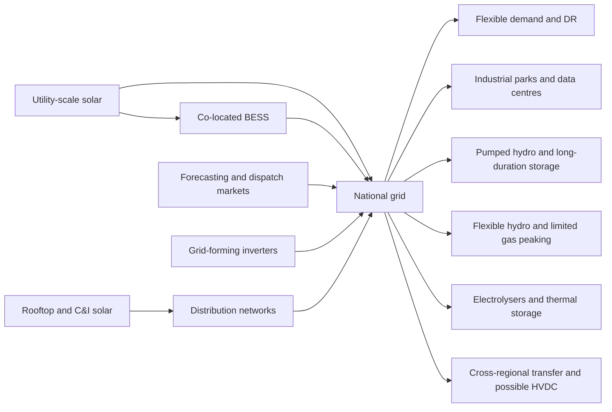
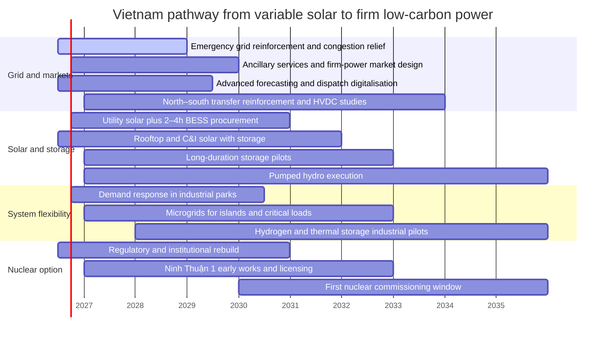

# Vietnam’s Nuclear And Solar Infrastructure And The Path To Firm Solar Power

## Executive summary

Vietnam now faces a two-track power strategy. On one track, Hanoi has formally revived nuclear power after shelving it in 2016, and the revised power plan adopted in April 2025 reintroduced nuclear with first units targeted for 2030–2035, alongside a total power-system investment envelope of about USD 136.3 billion to 2030. In March 2026, Vietnam and Russia signed an intergovernmental agreement for Ninh Thuận 1, envisaging two VVER-1200 units totalling 2.4 GW, but no financial terms were disclosed publicly. Vietnam still has **no operating commercial nuclear reactors**; its nuclear base remains institutional, regulatory and research-oriented rather than industrial. citeturn15news1turn38news0turn21news0turn40academia2

On the other track, solar is already real, large and politically embedded. Vietnam’s solar boom was one of the fastest in the world, driven by feed-in tariffs, with rooftop solar alone reaching about 9.5 GW across roughly 103,000 systems by mid-2024. The problem is no longer whether Vietnam can build solar, but whether it can **make solar dependable**. The bottleneck is the grid: rapid solar expansion in 2018–2020 overwhelmed transmission and distribution infrastructure, curtailed output, complicated dispatch, and created a legacy of investor disputes over pricing, contract treatment and payment practices. citeturn15news3turn17news2turn19news0turn26news2

For the next decade, the strategic conclusion is straightforward: **nuclear is a long-lead strategic hedge; firm solar is the near-term system solution**. Nuclear can eventually provide low-carbon firm capacity, but it is capital intensive, institutionally demanding and unlikely to resolve Vietnam’s immediate reliability needs before the early-to-mid 2030s. Solar, by contrast, can be deployed in one to two years when permits and grid access are in place, and IRENA’s latest work shows that hybrid solar/wind/battery systems in prime-resource regions can already deliver round-the-clock power at firm levelised costs of roughly **USD 54–82/MWh**, below or competitive with new fossil generation in many markets. citeturn31view1turn31view0

The most robust “stable solar” architecture for Vietnam is not a single technology but a stack of measures: **short-duration batteries for diurnal shifting and ancillary services; pumped hydro and other long-duration storage for evening and weather balancing; demand response; grid-forming inverters; stronger north–south transfer and selective HVDC; more flexible industrial tariffs and ancillary-service markets; microgrids for industrial parks and islands; and sector coupling into green hydrogen and thermal storage where utilisation supports the economics**. NREL and IRENA both emphasise that storage, interconnectors, and demand-side flexibility are central as variable renewable penetration rises. citeturn32view1turn43view0turn44view1turn36view2

The recommended roadmap for Vietnam is therefore threefold. In the **short term**, fix bankability and grid access, accelerate transmission, launch storage procurement, and deploy “solar plus 2–4 hour batteries” at constrained nodes. In the **medium term**, build a portfolio of pumped storage, 6–10 hour storage and flexible industrial demand response, while piloting grid-forming inverter requirements and firm-power auctions. In the **long term**, use nuclear only where institutional capability, financing and social licence are genuinely in place, while scaling a diversified firm-renewables system backed by hydrogen, seasonal flexibility, and deeper regional interconnection. On reasonable assumptions, a Vietnam firm-solar push through the mid-2030s would likely require on the order of **USD 20–45 billion** for storage, grid reinforcement, digitalisation and hybridisation, in addition to the solar generation capex itself; this estimate is explicitly scenario-based because public official cost breakdowns remain incomplete in the sources reviewed. citeturn15news1turn31view1turn45view0turn47view0

## Vietnam’s nuclear infrastructure

Vietnam’s nuclear power sector is currently **non-operational at commercial scale**. The country has a research reactor at Đà Lạt and a scientific and technical base around the Vietnam Atomic Energy Institute, but no grid-connected nuclear power plant is in operation. The institutional infrastructure therefore exists in embryo, not as an operating nuclear-power industry. citeturn40academia2turn23search4

The modern nuclear programme has moved through three phases. First, an expansion phase in the late 2000s and early 2010s, when Vietnam approved the Ninh Thuận projects and broader nuclear ambitions. Second, cancellation in 2016, when the National Assembly halted the programme amid cost and safety concerns after Fukushima. Third, revival from late 2024 onward, when nuclear was reinserted into power planning and external partner discussions resumed. Reuters reported in October 2024 that the amended PDP8 would include nuclear and in April 2025 that the revised plan envisaged first nuclear plants coming online in 2030–2035, with **up to 6.4 GW** in the first wave and another **8 GW** by mid-century. citeturn21news0turn15news1

The most concrete revived project is **Ninh Thuận 1**. In March 2026, Vietnam and Russia signed an intergovernmental agreement covering two VVER-1200 units with combined capacity of **2,400 MW**. Public reporting did not disclose financing terms, which is significant because financing structure is usually decisive for nuclear economics. Historically, the original Ninh Thuận 1 scheme was expected to rely heavily on sovereign or export-credit-backed lending rather than merchant-style project finance, and that remains the most plausible model today. citeturn38news0turn38search8

**Ninh Thuận 2** is more uncertain. Historically it was the Japanese-backed site. Reuters reported that Vietnam revived discussions with multiple foreign partners, including Japan, South Korea, France, Russia and the United States, but the public record gathered here does not show a final committed contractor or financing structure for Ninh Thuận 2. That makes it best classified, as of July 2026, as **revived in policy but not yet de-risked in execution**. citeturn21news0turn23news2turn23news1

The institutional framework is still the critical constraint. Vietnam’s Atomic Energy Law dates from 2008, and VINATOM’s published functions include research, technical support, policy support and support for quality, safety and environmental protection for a nuclear power programme. But a functioning commercial nuclear sector also requires a deeply resourced independent safety regime, emergency preparedness, security, operator capability, fuel-cycle contracting and waste policy. Those elements are not yet visible in enough public detail to treat Vietnam as construction-ready in the same sense as mature nuclear states. That is a material data gap, not merely a reporting gap. citeturn21search1turn23search4

Safety and waste management are therefore the most important unresolved issues. The historical Ninh Thuận 1 concept reportedly relied on Rosatom for fuel supply and spent-fuel handling or reprocessing arrangements, but the revived 2026 intergovernmental agreement disclosed in reporting did **not** publicly specify the waste-management model. For narrative and policy purposes, that means Vietnam has a **nuclear power ambition without a publicly robust end-of-fuel-cycle settlement**. In nuclear terms, that is not a small omission; it is central to social licence, regulation, bankability and sovereign risk. citeturn38news0turn21search3turn23search4

### Nuclear status table

| Project / asset | Status in mid-2026 | Capacity | Likely timeline | Core risks |
|---|---|---:|---|---|
| Đà Lạt research reactor | Operating research asset, not a power reactor citeturn40academia2 | Research-scale | Existing | Not relevant to grid supply |
| Ninh Thuận 1 | Revived; Russia-Vietnam intergovernmental agreement signed March 2026 citeturn38news0 | 2,400 MW | First units targeted 2030–2035 in revised plan citeturn15news1 | Financing, licensing, safety readiness, waste policy, local acceptance |
| Ninh Thuận 2 | Policy revival, but no equally firm public execution package found in sources reviewed citeturn21news0turn23news1 | Historically around 2,000 MW in initial two-unit framing citeturn23search9 | Unclear; likely after or alongside Ninh Thuận 1 if revived | Contractor choice, finance, regulatory capacity |
| Earlier broader multi-site plan | Cancelled / superseded | Much larger historical ambition | Not current | No current execution basis |

The analytical implication is that nuclear is strategically live but operationally immature. It may become part of Vietnam’s post-2035 low-carbon firm-capacity mix, but it is not yet the practical remedy for the country’s near-term solar-curtailment and reliability problems. citeturn15news1turn38news0

## Vietnam’s solar infrastructure, regulation and grid constraints

Vietnam’s solar sector is already one of the largest in Southeast Asia. The boom was driven by strong feed-in tariffs and rapid private investment, especially from 2018 to 2021. By mid-2024 Reuters reported about **103,000 rooftop systems** with roughly **9.5 GW** installed. Earlier data also indicated system-wide solar capacity exceeding 16 GW-equivalent by 2021, though exact current official totals are harder to pin down in the public sources collected because Vietnam’s latest planning documents are not fully transparent in the retrieved material. citeturn15news3turn9search4

The revised PDP8, adopted in April 2025, shifts even more weight to solar. Reuters reported that solar would account for **25.3%–31.1% of total installed capacity by 2030**, within a total system capacity target of **183–236 GW**. That implies a very large absolute solar fleet by 2030. Even using the low end of that capacity range, the implied solar total is material enough that the decisive question is not generation cost but **integration cost and flexibility**. citeturn15news1

The regulatory story is mixed. On the positive side, Vietnam has moved beyond the old pure FiT era. Reuters reported a new decree enabling Direct Power Purchase Agreements, allowing factories to contract renewable electricity directly, and plans for the utility to buy limited surplus rooftop solar output. These are meaningful steps because they broaden demand-side participation and gradually reduce the burden on a rigid single-buyer model. citeturn15news3

On the negative side, investor confidence has been damaged. In 2025 investors warned that retroactive changes to preferential tariffs could affect more than **USD 13 billion** of wind and solar investment, while other reporting described EVN withholding part of payments from some renewable projects via provisional tariffs. That matters not only for old projects; it increases the cost of capital for new solar, storage and hybrid projects, which is exactly the opposite of what Vietnam needs if it wants fast deployment of firm renewables. citeturn17news2turn19news0

Grid and transmission constraints are the core physical obstacle. AP reported that Vietnam’s solar surge “overwhelmed” the outdated grid, and this is consistent with the pattern seen in investor reporting and in the strategic shift of policy toward grid reinforcement and storage. In system terms, Vietnam built generation faster than evacuation capacity, especially in high-resource southern and south-central areas. That creates curtailment, weak local voltage control, congestion and poor price signals. It also means the next increment of solar has far lower value unless it is paired with storage, flexible demand, or stronger transmission. citeturn26news2turn17news2turn19news1

Transmission and distribution must therefore be treated as infrastructure equal in importance to generation. Vietnam’s geography intensifies this point. It is a long, narrow country with pronounced spatial mismatch between some of the best solar resource zones and major industrial demand centres. Even without a formal HVDC announcement in the sources gathered, the system logic is clear: stronger north–south backbone transfer, better 500 kV reinforcement, more reactive-power support, higher-quality forecasting and dispatch, and more sophisticated distribution-level hosting-capacity management are prerequisites for stable solar expansion. This is partly deduction from Vietnam’s documented congestion problem and partly general power-system engineering logic. citeturn26news2turn32view1turn36view2

Land use and environmental impacts are manageable but non-trivial. Utility-scale solar in Vietnam has often been developed on large contiguous sites; for example, the Dau Tiếng complex was reported at about **500 MWac on roughly 500 hectares**, while Phong Điền was reported at **35 MWac on roughly 45 hectares**. These examples suggest land intensity broadly in line with international utility-PV norms, but they also show why cumulative land take becomes politically sensitive as the sector scales. In Vietnam, the sharpest conflicts are likely to concern agricultural land conversion, biodiversity-sensitive siting, water use for module cleaning in dry provinces, land compensation, and cumulative visual and habitat impacts. Floating solar and rooftop/self-consumption solar reduce some of those pressures. citeturn15search6turn19search11

### Solar status and financing table

| Solar segment | Current status | Main financing / commercial model | Main constraint |
|---|---|---|---|
| Utility-scale solar | Operating at scale; expansion re-emphasised in revised PDP8 citeturn15news1turn26news2 | Historically FiT-backed project finance under EVN PPAs; future model likely auctions, hybrids and selective DPPAs | Transmission congestion, curtailment, investor confidence |
| Rooftop solar | Strong installed base: about 103,000 systems and 9.5 GW by mid-2024 citeturn15news3 | Commercial / C&I self-consumption, some export remuneration, DPPA-related demand growth | Distribution hosting capacity, export caps, tariff uncertainty |
| Solar plus storage | Still emerging in Vietnam; encouraged by need rather than yet-mature market design citeturn26news2turn31view1 | Hybrid PPAs, private C&I resilience investments, future firm-power auctions | Missing ancillary-service pricing and storage revenue stack |
| Floating solar | Promising for reservoirs and industrial water bodies; not yet a dominant share in gathered sources | Project finance or utility development | Reservoir coordination, environmental licensing |

### System-integration diagram

The policy conclusion from the solar side is that Vietnam does **not** need to choose between “more solar” and “a stable grid”. It needs to build only the kind of solar that improves the grid rather than stresses it further: hybrid, flexible, locationally rational and bankable. citeturn26news2turn31view1turn32view1

## How solar becomes a stable energy source

The first principle is conceptual. Solar does not become “stable” because panels themselves change; it becomes stable because the **system built around solar** changes. IRENA’s 2026 work frames the problem as one of adequacy and flexibility rather than simple generation cost, and shows that co-located renewable-plus-storage systems are increasingly able to provide reliable round-the-clock electricity. citeturn31view0turn32view1

The second principle is temporal. Different flexibility tools solve different problems. **Batteries** solve seconds-to-hours problems: frequency, reserves, ramping and evening shifting. **Pumped hydro and other long-duration storage** solve multi-hour to multi-day imbalances. **Demand response** and **time-varying tariffs** move load into solar hours. **Transmission and interconnection** smooth local cloud variability and move surplus to load centres. **Hydrogen, thermal storage and flexible fuels** become more useful when the system approaches very high renewable shares and begins to face weekly or seasonal mismatch. NREL’s Storage Futures work is explicit that storage duration tends to increase as deployment rises, and that seasonal storage becomes far more important in systems with very high variable renewable shares. citeturn43view0turn44view1

### Technology evaluation table

| Technology / strategy | What it solves | Indicative cost / economics | Deployment timeline | Scalability for Vietnam | Main risks / caveats |
|---|---|---|---|---|---|
| Lithium-ion BESS, especially LFP | Fast reserves, evening peak shifting, congestion relief, solar clipping recovery | NREL’s 2020 4-hour LIB reference shows about **USD 320/kWh energy cost plus USD 246/kW power cost**, with RTE around **86%**; later IRENA shows battery project costs down **89%** from 2010 to 2023 and firm solar+storage in prime regions at **USD 54–82/MWh** citeturn47view0turn48view1turn31view1 | Typically 1–2 years once permitted and connected citeturn31view1 | Very high for 2–4 hour and some 4–6 hour applications | Revenue-stack immaturity, fire safety, land and interconnection at node |
| Pumped-storage hydropower | Daily and multi-hour balancing, inertia-like services, bulk shifting | NREL reference values show PSH around **USD 72.4/kWh energy** and **USD 1,150.8/kW power**, RTE around **80%**, long asset life citeturn47view0 | Usually 5–10+ years | High where topography and permitting allow | Long lead times, environmental and social impacts, high upfront capex |
| CAES / LAES / PTES | 8–100 hour balancing, system adequacy | NREL’s reference dataset shows CAES and PTES can have relatively low energy-cost components but lower efficiency, especially CAES at about **52% RTE**; recent research suggests adiabatic CAES can become viable over **10–100 hour** durations with suitable geology citeturn47view0turn37academia0 | Demonstration to early commercial now; broad deployment later this decade | Moderate; geology and industrial siting matter | Lower maturity, site dependence, uncertain bankability |
| Flow batteries / sodium systems | Longer daily shifting with higher cycle life than standard Li-ion | NREL reference values put flow batteries at higher capex than 4-hour LIB but with long cycle life; RTE roughly **68%** in the reference set citeturn47view0 | 2–5 years for commercial scaling | Moderate for industrial and grid nodes | Cost and vendor-bankability today |
| Hybrid solar + gas | Better firmness and capacity value | Can stabilise output quickly, but gas price and carbon exposure remain; IRENA’s 24/7 analysis suggests hybrid renewables with storage are already beating new fossil in prime regions citeturn31view1 | 2–5 years if gas supply exists | Moderate, but weakens decarbonisation case | Fuel price volatility, LNG dependence, emissions lock-in |
| Hybrid solar + storage | The most direct path to firm daytime and evening power | Prime-region firm cost already **USD 54–82/MWh** for solar plus storage; co-location can reduce total cost by about **5%–10%** relative to separate installations in NREL analysis citeturn31view1turn46view2 | 1–3 years | Very high | Needs tariff and dispatch design to monetise firmness |
| Demand response and flexible tariffs | Shifts industrial load into solar hours, reduces storage need | Often cheaper than supply-side capex where large industrial loads exist; IRENA highlights demand-side management as a key flexibility resource citeturn32view1 | 1–3 years | Very high, especially in industrial parks | Requires metering, tariff reform, dispatch rules, customer trust |
| Grid-forming inverters | Stability in low-inertia systems, black start, voltage support | Not a generation source but a critical enabler; NREL emphasises future high-IBR systems will need next-generation grid-forming controllers and gradual field validation, starting in microgrids and island systems citeturn36view2 | Immediate pilots; wider standards adoption over 3–7 years | High technical value | Standards, testing, operator confidence |
| HVDC / stronger interconnection | Geographic smoothing, congestion relief, bulk north–south transfer | Capital intensive but system-wide value can be very high in long, narrow systems; IRENA treats interconnectors as central flexibility resources citeturn32view1 | 5–10 years | High strategic value for Vietnam | Permitting, sovereign coordination, large capex |
| Microgrids | Reliability for islands, industrial parks, critical loads | Cost-effective where outage cost is high; NREL sees grid-forming inverters entering first via microgrids and islands citeturn36view2 | 1–3 years | High in islands, ports, industrial zones | Standardisation and ownership models |
| Green hydrogen / thermal storage | Multi-day to seasonal balancing, industrial decarbonisation, flexible fuel | Vietnam’s hydrogen strategy targets **100,000–500,000 t/y by 2030** and **10–20 Mt/y by 2050**; NREL finds seasonal storage becomes more important as systems move to >90% VRE citeturn26news1turn44view1 | 3–10+ years | Medium to high, but only in good-use clusters | Low round-trip efficiency, demand-side economics must justify |

Two findings matter most for Vietnam.

First, **lithium-ion batteries dominate the near term**, particularly for 2–4 hour and some 4–6 hour use cases. NREL’s study shows why: high round-trip efficiency, falling cost, and strong fit with PV. IRENA’s work adds that battery construction timelines are much shorter than gas or nuclear alternatives. citeturn47view0turn31view1turn43view0

Second, **batteries alone are not enough** in a monsoonal, long, transmission-constrained system. NREL’s work shows that as renewable penetration becomes very high, storage durations rise and seasonal storage begins to matter. For Vietnam that does not mean “hydrogen now at any price”; it means that today’s planning should avoid locking the system into a pure 4-hour-battery mindset. Pumped hydro, long-duration pilots, flexible industry and regional transfer must be planned in parallel. citeturn44view1turn32view1

## Comparative case studies and lessons for a Vietnamese narrative

The best international evidence does **not** support the claim that solar by itself becomes baseload. It supports a subtler, stronger claim: a power system can make solar part of a **firm, dispatchable output block** when storage, hybridisation, market design and transmission are added. IRENA’s 2026 “24/7 renewables” analysis is especially useful because it is framed exactly around firm electricity rather than raw renewable output. citeturn31view0turn31view1

### Case-study table

| Country / region | Why it matters | Main lesson for Vietnam |
|---|---|---|
| **China** | IRENA says China currently defines the global cost floor for firm renewables, while Reuters reports large-scale storage expansion is being driven by falling battery costs and strong peak–valley pricing differentials. citeturn31view0turn37news3 | Stable solar works when storage is large, cheap and actually monetised through market spreads and system services. |
| **India** | IRENA identifies India as one of the fast-declining cost regions for firm renewables. citeturn31view0 | A high-solar emerging economy can move from “cheap daytime solar” toward firm renewable blocks if auctions and contracts reward delivery profile rather than just megawatts installed. |
| **Brazil** | IRENA identifies Brazil among the geographies rapidly approaching fossil-fuel parity for firm renewable electricity. citeturn31view0 | Strong resource quality plus system flexibility can turn variable renewables into competitive firm supply, especially where hydro or transmission adds balancing value. |
| **Gulf region** | IRENA highlights the Gulf as one of the strongest emerging regions for cost-competitive firm solar and wind. citeturn31view0turn31view1 | Prime solar resource sharply improves the economics of firmed solar; Vietnam’s south-central provinces are not Gulf-like, but their higher irradiance can still support hybrid projects with good storage economics. |
| **United States high-renewable studies** | NREL’s Storage Futures work shows that as renewable penetration rises, storage duration increases and seasonal flexibility eventually becomes important; grid-forming inverters are also expected to be deployed gradually from microgrids and island systems upward. citeturn44view1turn36view2 | Vietnam should treat today’s 2–4 hour battery rollout as phase one, not the whole end-state. |

The narrative lesson is powerful. Vietnam does not need to choose between “cheap but unstable solar” and “stable but slow nuclear”. The real choice is between a **first-generation solar system**, which maximises installed megawatts but leaves curtailment and insecurity unresolved, and a **second-generation solar system**, which treats flexibility, resilience and bankability as part of the plant rather than as afterthoughts. citeturn31view0turn32view1

That narrative also reframes nuclear. Nuclear is not the antonym of solar in Vietnam’s future. It is the slow, sovereign, strategic option that may later provide deep firmness and fuel diversification. Solar, storage, demand flexibility and transmission are the fast, modular, industrial option that can stabilise the grid **before** nuclear arrives—if nuclear arrives on schedule at all. citeturn15news1turn38news0

## Recommended roadmap for Vietnam

The recommended roadmap below assumes that Vietnam wants three outcomes simultaneously: avoid near-term shortages, absorb much more solar without destabilising the grid, and preserve the nuclear option without relying on it to solve the 2020s. That is the most credible reading of the current policy trajectory. citeturn15news1turn21news0turn26news2

### Roadmap chart

### Recommended action table

| Time horizon | Priority actions | Why these matter | Indicative investment range |
|---|---|---|---:|
| **Short term** | Freeze retroactive contract risk; restore predictable payment discipline; launch congestion-relief grid upgrades; procure solar + 2–4h BESS at constrained nodes; scale rooftop/C&I solar under clear export rules; launch industrial demand-response programmes; require probabilistic forecasting from large solar plants | This is the fastest route to reduce curtailment and increase dispatchability without waiting for major thermal or nuclear projects. citeturn19news0turn17news2turn26news2turn31view1 | **USD 6–12 bn** *(assumption: grid reinforcement, digitalisation, 5–10 GWh early BESS, no major pumped hydro yet)* |
| **Medium term** | Build 5–10 GW / 20–40 GWh of grid BESS and hybrid solar-storage; execute at least one 1–1.5 GW pumped-storage project; roll out firm-power auctions and ancillary-service markets; strengthen north–south transfer; set grid-forming inverter standards for new utility-scale inverter-based resources; deploy microgrids in islands, ports and industrial parks | This is the phase that turns solar from “cheap energy” into “reliable capacity”. NREL and IRENA both point to longer duration, flexibility and stability functions as renewable penetration rises. citeturn44view1turn36view2turn32view1 | **USD 14–28 bn** *(assumption: bulk BESS at roughly USD 300–450/kWh installed, one major pumped hydro project, substantial transmission spend)* |
| **Long term** | Scale 6–10 hour and selected multi-day storage; use green hydrogen and thermal storage where industrial load factors justify them; build selective HVDC or equivalent high-capacity transfer solutions; bring nuclear online only if regulatory and financing readiness is demonstrably robust; integrate ASEAN cross-border flexibility where economical | This phase addresses monsoon variability, seasonal mismatch and deep decarbonisation rather than simple evening shifting. citeturn44view1turn26news1turn15news1 | **USD 20–45 bn** *(assumption: long-duration storage scale-up, hydrogen pilots to commercial clusters, major interconnection spend; excludes full nuclear plant capex)* |

**Assumptions behind the investment ranges.** Public official cost breakdowns for the revised PDP8 and for individual storage targets were not available in the retrieved source set, so these are bottom-up planning estimates rather than official numbers. For storage, the assumptions are anchored to NREL reference values for LIB and PSH and adjusted into broad 2026 planning ranges. For grid and digitalisation, ranges are inferred from the scale of Vietnam’s 2030 capacity expansion and from the centrality of transmission as the documented bottleneck. citeturn45view0turn47view0turn15news1turn26news2

### Concrete policy measures

The most important policy measure is **contractual rehabilitation**. Vietnam cannot finance the next generation of hybrid solar and storage cheaply if lenders believe tariff or payment rules can be changed retroactively. The 2025 investor dispute is therefore not a peripheral issue; it is a system-cost issue. citeturn17news2turn19news0

The second is **market redesign**. Vietnam needs procurement and dispatch rules that pay for profile, not just kilowatt-hours. That means capacity-style value for the evening peak, ancillary services, fast frequency response, synthetic inertia, reactive power and forecast performance. If “firm blocks” are procured rather than bare generation, technology choice will improve automatically. citeturn31view1turn32view1turn36view2

The third is **locational discipline**. New solar should not be approved on a pure “resource-first” basis. It should be prioritised where it relieves congestion, sits behind flexible load, or is paired with storage and grid support. This is particularly important for south-central provinces with excellent solar resources but recurrent network constraints. citeturn26news2turn31view1

The fourth is **institutional sequencing**. Nuclear should proceed only in parallel with, not instead of, a serious build-out of the solar-flexibility stack. If nuclear is delayed, Vietnam still wins. If nuclear proceeds, it will enter a far more flexible, modernised grid. Either way, solar firming remains the no-regrets strategy. citeturn15news1turn38news0

## Open questions and key references

Several important questions remain open in the public record reviewed here.

Public official detail on the **revised PDP8 project-by-project storage, transmission and solar breakdown** remains incomplete in the sources retrieved, so some capacity and investment ranges must be treated as planning assumptions rather than official point forecasts. citeturn15news1turn26news2

Public detail on the **financing structure, sovereign guarantees, waste-management arrangements, and full licensing path** for revived nuclear projects remains thin. The Russia agreement for Ninh Thuận 1 is real, but the disclosed terms were not yet sufficient to support a full bankability assessment. citeturn38news0

Public data on **PV curtailment volumes, nodal congestion, hosting-capacity maps, and public-opinion polling** for both nuclear and solar in Vietnam are limited in the retrieved material. That means any narrative about “public acceptance” should be made cautiously: solar plainly has broad commercial uptake, especially in rooftop form, while nuclear’s social licence appears politically revived but not yet publicly quantified. citeturn15news3turn21news0

### Key references

The most decision-useful sources in this report were the following:

- Reuters reporting on Vietnam’s revised PDP8, solar targets, rooftop policy, investor disputes, hydrogen strategy and revived nuclear agreements. citeturn15news1turn15news3turn17news2turn19news0turn21news0turn26news1turn38news0  
- IRENA, *Renewable Power Generation Costs in 2023*. citeturn13view1turn48view2  
- IRENA, *24/7 renewables: The economics of firm solar and wind*. citeturn31view0turn31view1  
- IRENA, *Flexibility for a secure and affordable power sector transformation*. citeturn32view1  
- NREL, *Research Roadmap on Grid-Forming Inverters*. citeturn36view2  
- NREL, *Storage Futures Study: Key Learnings for the Coming Decades*. citeturn43view0turn44view1  
- NREL, *Storage Technology Modeling Input Data Report*. citeturn45view0turn47view0  
- Recent academic literature on adiabatic compressed-air storage and long-duration flexibility economics. citeturn37academia0

The central judgement, after weighing the evidence, is this: **Vietnam should treat solar firming—not raw solar buildout, and not near-term nuclear delivery—as the main reliability project of the next decade**. Nuclear may still matter greatly after 2035. But the system that will make Vietnam prosperous, cleaner and more secure by then must be built first with transmission, storage, flexibility, market design and disciplined solar deployment. citeturn15news1turn31view1turn32view1turn36view2